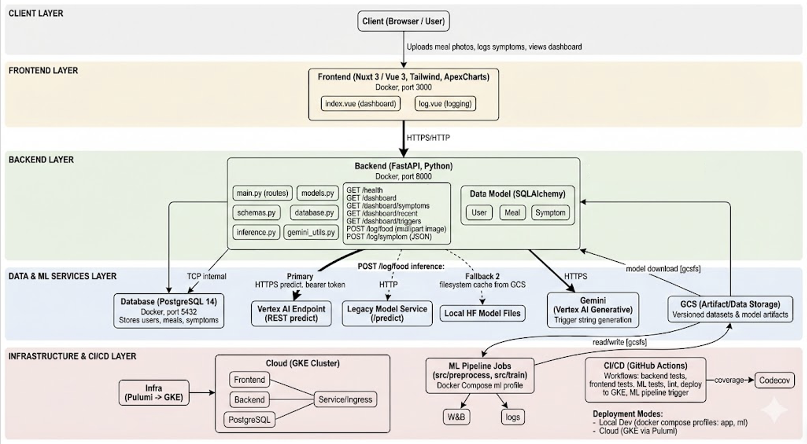

# Medium Blog Post

This article was produced as part of the final project for Harvard’s AC215 Fall 2025 course.

Links: [Project Github Repo](https://github.com/willcbelcher/AC215_NutriSnap), [Video](https://drive.google.com/file/d/1BnXE7Rae6E78U7KmtDDniUTGy9WBFRo0/view?usp=sharing)

Team: NutriSnap - Prakrit Baruah, William Belcher, Vineet Jammalamadaka

## The Problem

There are currently 3 million people in the US who suffer from irritable bowel disease (IBD), 30 million people who suffer from irritable bowel syndrome (IBS), and a further 40 million people who have some form of gastrointestinal (GI) disorder. Diet is an essential consideration in improving outcomes for people with chronic GI issues. For some, diet may be the central cause of their distress, for others it can improve recovery from periods of active disease and reduce disease flare-ups.

NutriSnap is a consumer health tool that helps people with chronic gastrointestinal issues understand which foods they consume are causing adverse symptoms, giving them the confidence to control their symptoms and meet their lifestyle goals.

## The Solution

NutriSnap makes logging foods as simple as possible and helps users uncover hidden links between foods consumed and triggers experienced.

1. Users are greeted by the home page with four views: i) trends in recent symptoms; ii) most likely triggers based on symptoms and meals;  iii) recent symptoms experienced; and iv) recent meals.

2. Users can easily log their meals by taking pictures

## Technical Implementation

NutriSnap is a full-stack application that uses a combination of computer vision and natural language processing to analyze food images and provide nutritional information. The application is built using Python, FastAPI, and Nuxt.js.

The application is deployed on Google Cloud Platform (GCP) using Google Kubernetes Engine (GKE) to host the backend (FastAPI), the frontend (Nuxt.js), and the database (PostgreSQL). The application is containerized using Docker and the container images are stored in Google Artifact Registry. The computer vision model to identify food items is deployed separately into a Vertex AI model and is called from the backend using the Vertex AI Python client library.

There are three primary models used in the application. First, the computer vision model, which is trained on over 100,000 food images with over 1.8 Billion parameters. This identifies food images the users upload. Next, the nutrition model, which is a Gemini Pro model that is used to determine potential triggers of the food item. Finally, we use Cox Proportional Hazard models to determine top triggers for the user based on their symptom and meal history.

The application also utilizes a CI/CD pipeline using GitHub Actions to automate testing and deployment. All components are orchestrated within a Google Kubernetes Engine (GKE) cluster, communicating within a secure VPC to ensure low latency, scalability, and high availability.

## Impact

NutriSnap provides a frictionless and supportive experience for people managing GI conditions or food sensitivities. By enabling users to log meals in seconds and automatically analyzing potential triggers, NutriSnap helps people identify meaningful patterns between foods and symptoms—something that is often time-consuming and difficult in traditional journaling. Our app automates the hard parts of food logging, delivering actionable feedback securely and scalably.
